#  Ngx-Workshop

Get ready for an exciting journey as we embark on a fun and interactive adventure with Ngx-Workshop! Our mission is to make learning how to create full stack web applications not just educational but also an absolute blast. 🎓 🎢

## What can you expect? 🧐
By using the application workshops, you'll dive headfirst into crafting the ultimate full stack workshop creation application. Ngx-Workshop has three core features to keep you engaged and help you level up your skills:

1. Content Management System (CMS) 📚 - As an admin, you'll have the power to create and manage workshops with ease, turning your ideas into reality.

2. Tests Generator 🧪 - Put your knowledge to the test! Generate quizzes on workshop topics to ensure you're mastering the content.

3. User Journey Tracking System 🗺️ - Keep tabs on your progress and celebrate your achievements as you navigate through the world of full stack web development.

So, buckle up and get ready to have a fantastic time exploring and learning with Ngx-Workshop! Happy coding! 🎉 💻

<br>

# Get Set Up in No Time! 🛠️ 💨

Ready to run Ngx-Workshop on your local machine? Let's get everything installed in a snap! Just follow these simple steps:

## Quick 'n' Easy Installation 🏃‍♂️

Here's a list of dependencies you'll need to get up and running:

- NodeJs
- Angular CLI
- NestJs CLI
- Docker
- Nginx
- MongoDB
- InfluxDB

We're all about keeping it simple (remember [KISS](https://en.wikipedia.org/wiki/KISS_principle) 😉), so we'll focus on just getting everything installed for now. In future workshops, we'll dive deeper into each of these dependencies. Of course, feel free to install them your own way if you prefer!

> **Windows Users, Heads Up!** 🚨
> 
> We highly recommend using WSL (Windows Subsystem for Linux) to get the best experience.
> 
> You can find the installation guide [here](https://learn.microsoft.com/en-us/windows/wsl/install).

That's it! You're all set to start your Ngx-Workshop adventure. Happy installing! 🎉 🔧

 
<br>

## NodeJs with NVM: Smooth Sailing Ahead!
[](https://github.com/nodejs/node)
[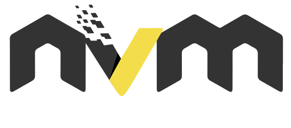](https://github.com/nvm-sh/logos)

[Official Documentation](https://github.com/nvm-sh/nvm)

NVM (Node Version Manager) is our go-to choice for effortlessly installing different versions of NodeJs. Let's get you started with NVM and NodeJs in a jiffy!

### Installing NVM

Run the following command in your terminal to install NVM:

```sh
curl -o- https://raw.githubusercontent.com/nvm-sh/nvm/v0.39.3/install.sh | bash
```

Once it's done, restart your terminal or open a new one.

### Installing NodeJs 18.10.0

With NVM at your side, getting NodeJs 18.10.0 is a breeze. Just run:

```sh
nvm install 18.10.0
```

And that's it! You're all set with NodeJs, and you can thank NVM for making it so simple. Enjoy your Ngx-Workshop adventure! 🎉🌐

<br>

## Angular CLI: Turbocharge Your Development Experience!

[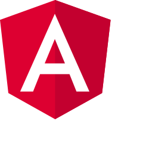](https://github.com/nodejs/node) [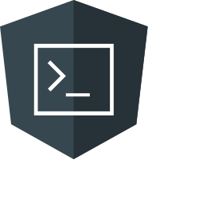](https://github.com/nvm-sh/logos)

[Official Documentation](https://angular.io/cli)

Angular CLI is a game-changing tool that helps us quickly generate boilerplate application code, making for a fantastic development experience.

### Installing Angular CLI

It's super easy to install the Angular CLI using the `npm` package manager. Just run the following command:

```sh
npm install -g @angular/cli
```

And there you have it! Angular CLI is now installed and ready to help you supercharge your Ngx-Workshop experience.

<br>

## NestJs CLI: Seamless Frontend to Backend Transition!

[](http://nestjs.com/)

[Official Documentation](https://docs.nestjs.com/cli/overview)

NestJs follows the same patterns as Angular, which means you'll now be enjoying isomorphic programming (buzzword joke 😉). This makes transitioning between frontend and backend development a breeze!

### Installing NestJs CLI

Getting the NestJs CLI installed is as easy as pie with the `npm` package manager. Just run this command:

```sh
npm install -g @nestjs/cli
```

And voilà! The NestJs CLI is installed and ready to help you smoothly switch between frontend and backend development in your Ngx-Workshop journey. Keep up the great work!

<br>

## Docker: Say Goodbye to "It Works on My Machine"!

[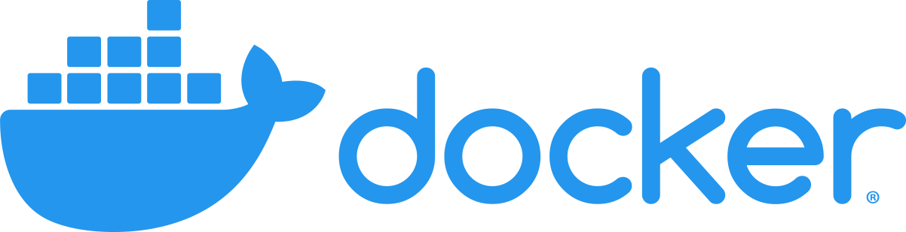](https://www.docker.com/)

[Official Documentation](https://docs.docker.com/)

Docker took the "it works on my machine" meme and turned it into a powerful solution. Docker sets up self-contained images of the next three dependencies we need, ensuring a consistent environment across the board.

### Installing Docker Desktop

Get started by installing the Docker Desktop [application](https://www.docker.com/products/docker-desktop/):

[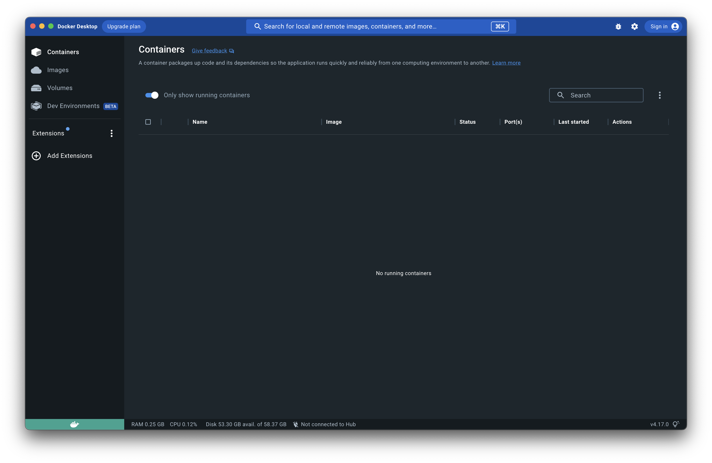](https://www.docker.com/products/docker-desktop/)

With Docker in your toolkit, you can confidently develop and deploy, knowing that your environment will stay consistent throughout your Ngx-Workshop journey. Enjoy the power of containerization! 🎉 📦

<br>

## Nginx: Unleash the Power of a Blazing Fast Reverse Proxy!

[](https://www.nginx.com/)

[Official Documentation](https://docs.nginx.com/)

Nginx brought a groundbreaking change to the world of reverse proxies with its ultra-fast performance. We'll tap into that incredible speed for local development, and later explore the wonders of load balancing. 🚀 🌐


## Installing Nginx Docker Container

To get started with Nginx, install the Nginx Docker Container using the following command:

```sh
docker run --name workshop-nginx -d -p 80:80 nginx
```

### Configuring Proxy Rules
After installing, we need to add some proxy rules to `/etc/nginx/conf.d/default.conf`.

Simply copy the content of this [file](install-helpers/default.conf) into the Nginx default.conf file.

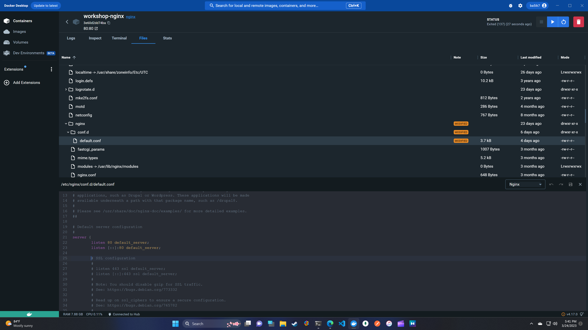

Finally, stop and restart the Docker Nginx container to apply your changes.

With Nginx now in your arsenal, you're ready to conquer the world of reverse proxying on your Ngx-Workshop adventure. Enjoy the speed! 🎉 ⚡

<br>

## MongoDB: Flexible, Scalable, and High-Performance Data Management!

[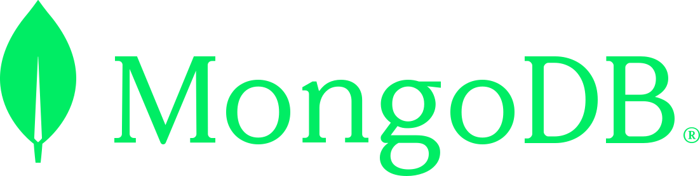](https://www.mongodb.com)

[Official Documentation](https://www.mongodb.com/docs/)

MongoDB is a powerful, flexible, and scalable NoSQL database system that allows you to handle your data with high performance and ease.

### Installing MongoDB Docker Container

Get MongoDB up and running by installing the MongoDB Docker Container with the following command:

```sh
docker run --name workshop-mongo -d -p 27017:27017 mongo:latest
```

## MongoDB Compass: Visualize and Manage Your Data Effortlessly!
[Official Documentation](https://www.mongodb.com/docs/)

### Installing MongoDB Compass
Install the MongoDB Compass desktop [application](https://www.mongodb.com/try/download/compass):

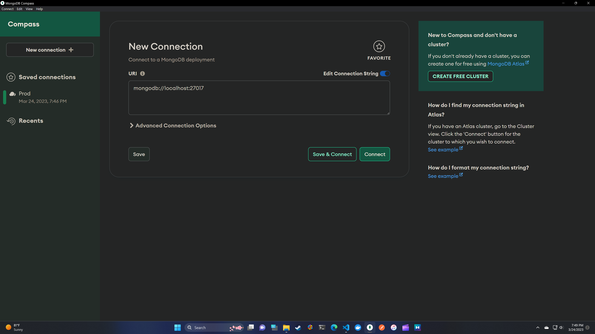

### Configuring MongoDB Compass
Connect to the localhost instance, create a new database named `workshop-viewer`, and then create four new collections:

- categories
- sections
- workshops
- users

### Importing Helper Files

Import the following helper files found [here](install-helpers/):

- categories.json
- sections.json
- workshops.json

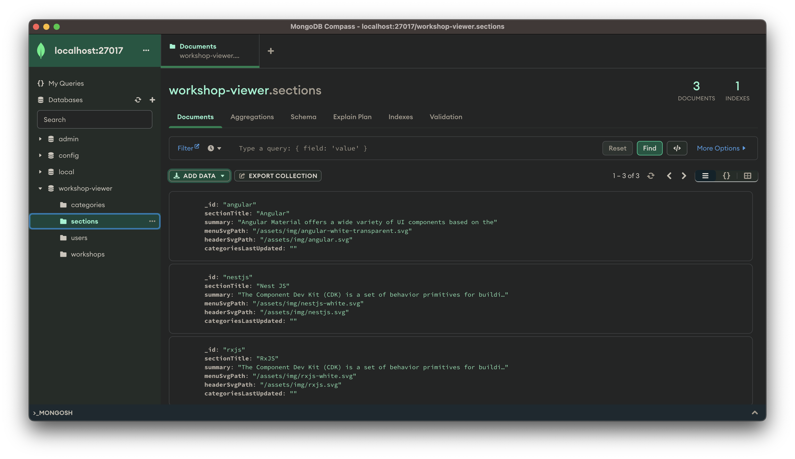

We'll walk you through creating a user in the workshop-api project's README.

With MongoDB and MongoDB Compass in your toolkit, you're all set to manage and visualize data with ease in your Ngx-Workshop journey. Enjoy the power and flexibility of this dynamic duo! 🎉🔥

<br>

## InfluxDB: High-Performance Time Series Data at Your Fingertips!

[](https://www.influxdata.com/)

[Official Documentation](https://docs.influxdata.com/)

### Installing InfluxDB Docker Container

Get InfluxDB up and running by installing the InfluxDB Docker Container with the following command:

```sh
docker run --name workshop-influxdb -d -p 8086:8086 influxdb:2.0.9
```

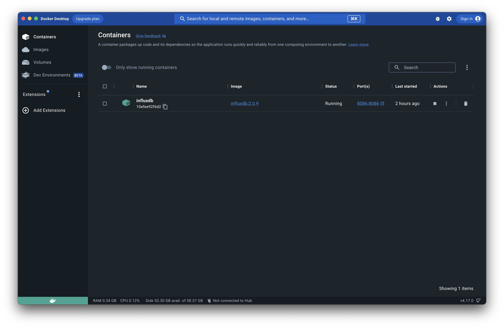

## InfluxDB Admin: Manage Your Data Like a Boss!
Navigate to the InfluxDB admin panel at `localhost:8086` and set up your admin account. While setting up the organization and bucket name, use these values:

- Organization Name: `Ngx-Workshop`
- Bucket Name: `Ngx-Workshop-Bucket`

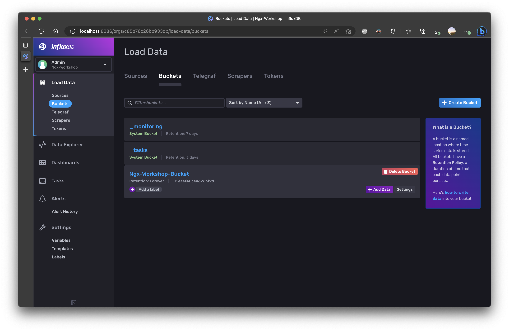

Next, navigate to the Load Data section and Tokens tab. Generate a new token named:

- `Ngx-Workshop-API`

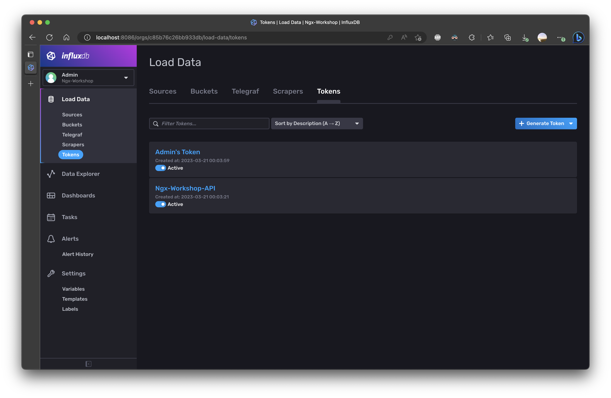

🎉 🚀 Congratulations! You've successfully installed all the required dependencies for your Ngx-Workshop project. You're now equipped with a powerful set of tools to create a full stack web application. You've got NodeJs, Angular CLI, NestJs CLI, Docker, Nginx, MongoDB, MongoDB Compass, and InfluxDB all ready to rock! Let the fun and engaging learning journey begin! 🌟 🌈

<br>

# Serving Locally: A Fun and Fuss-Free Way to Develop! 🎉💻

Serving your application locally allows you to develop and test your project in a comfortable and efficient environment. This way, you can experiment, make changes, and see the results in real-time without any delays or deployments. Say goodbye to the hassle of working on remote servers and embrace the power of local development!

## Code Editor: VS Code - A Developer's Dream!

[](https://code.visualstudio.com/)

Alright! Now that we've got all the dependencies installed, it's time to set up a local development environment. While it's up to you which code editor you prefer, we highly recommend using VS Code. Our workshops will be using this editor and its plugins throughout our journey.

You can download VS Code [here](https://code.visualstudio.com/download). .

## Cloning the Repo and Installing NPM Packages: Just a Couple of Commands Away!

[](https://github.com/)

If you haven't already cloned this repo, go ahead and do so now with this `git` command:

```sh
git clone git@github.com:Ba5ik7/ngx-workshop.git
```

> Don't have SSH connected to GitHub? No worries! Follow this [link](https://docs.github.com/en/authentication/connecting-to-github-with-ssh) to get up and running with connecting to GitHub with SSH.

Next, navigate to the new repo's folder and run this command to install all the required Node packages:

```sh
npm i
```

## Adding the NestJs Environment File: A Hidden Treasure!

In the NestJs project folder, located at `apps/workshop-api/`, create a hidden file named `.env`. Then, add the following content:

```ini
MONGODB_URI=mongodb://host.docker.internal:27017/workshop-viewer

JWT_SECRET=secretKey
JWT_ACCESS_TOKEN_AUDIENCE=host.docker.internal:3000
JWT_ACCESS_TOKEN_ISSUER=host.docker.internal:3000
JWT_ACCESS_TOKEN_TTL=3600
JWT_REFRESH_TOKEN_TTL=86400

INFLUXDB_URL=http://host.docker.internal:8086
INFLUXDB_TOKEN=NEED_TO_ADD_THE_INFUXDB_TOKEN_WE_GENERATED
```

Replace `NEED_TO_ADD_THE_INFUXDB_TOKEN_WE_GENERATED` with the token we created earlier while setting up InfluxDB.

## Nx: Supercharge Your Monorepo!

[](https://nx.dev/)

[Official Documentation](https://nx.dev/getting-started/intro/)

This monorepo uses Nx to help manage projects. Nx builds on the functionality of the `Angular CLI` and `NestJs CLI`, adding even more features! The VS Code plugin for Nx comes pre-installed, so there's nothing left to do on that front.

Start the application locally by running this `Nx CLI` command:

```sh
nx run-many --target=serve
```

Navigate to `localhost` and you'll see this:

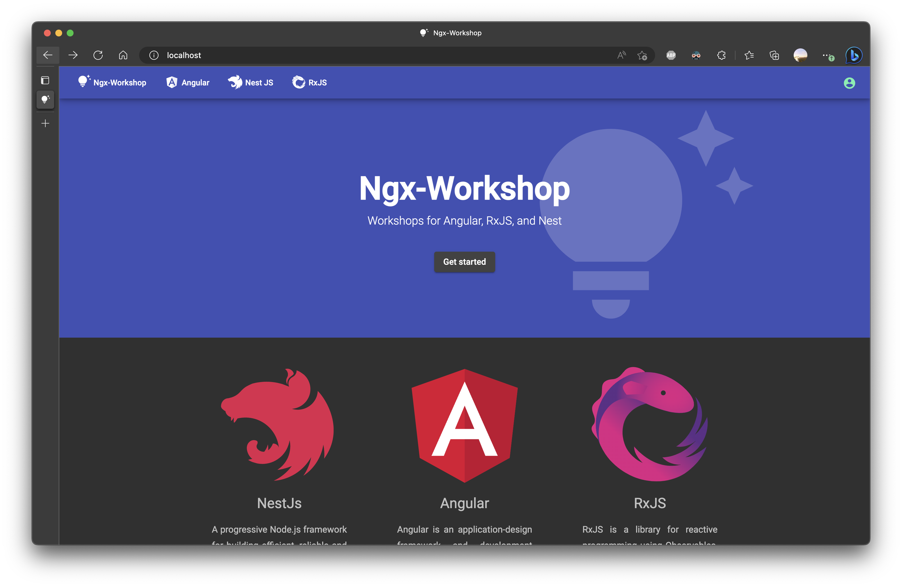


After having fun exploring, head over to `localhost/admin` to set up the admin user:

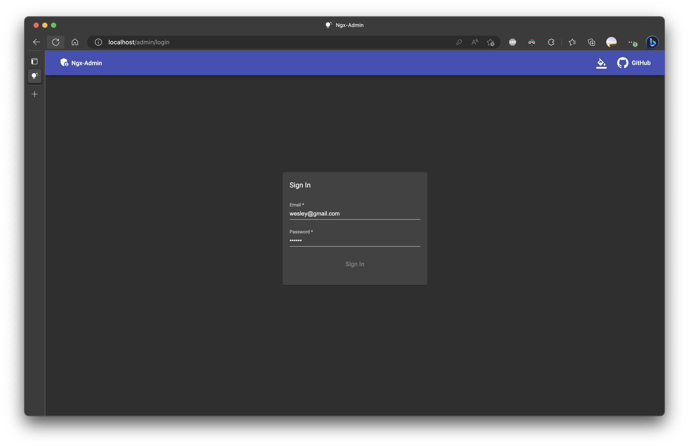

🎉 Now you can follow the Ngx-Workshop workshops locally or online at Ngx-Workshop. 🎉