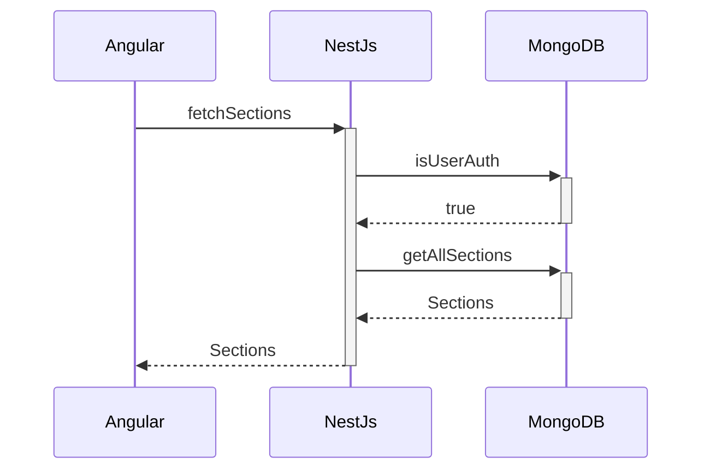

#  Ngx-Workshop

```mermaid
sequenceDiagram
    Angular->>+NestJs: fetchSections
    NestJs->>+MongoDB: isUserAuth
    MongoDB-->>-NestJs: true
    NestJs->>+MongoDB: getAllSections
    MongoDB-->>-NestJs: Sections
    NestJs-->>-Angular: Sections
```